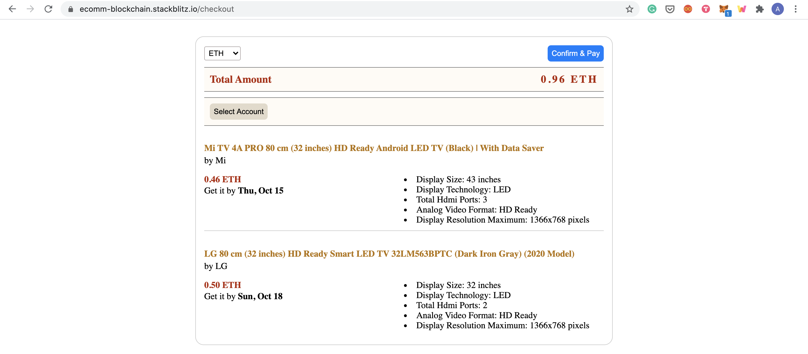

# Ecommerce portal with crypto pay

It's a simple E-commerce web portal, built with angular and web3.js. It provides a list of available products to select, selected products are added to the cart and on the checkout page, payment can be done with crypto-currencies.

All the transactions are done with the MetaMask wallet. 

[Click here ](https://ecomm-blockchain.stackblitz.io) to launch the live application.

At the very first page, the list of products is shown.

Products added to cart are displyed on the top bar.

Clicking on checkout will take you to the payment page. Here, all the list of products in the cart can be seen. 

Click on the Select Account button to connect with an account using Metamask.

The selected account will then be displayed on the screen. 

On the top left corner of the screen, the crypto currency can be selected from the dropdown. 

Two options are available, one is Ether (ETH) and another is custom ERC20 Token named as Ecommerce Token (ETK), made for POC purpose.

On selecting currency, respective amount will be shown on the screen. 

Click on Confirm & Pay to initiate the transaction. It will take you to the MetaMask wallet, where transaction can be confirmed.

After confirmation, transaction status will be displayed on the screen.

